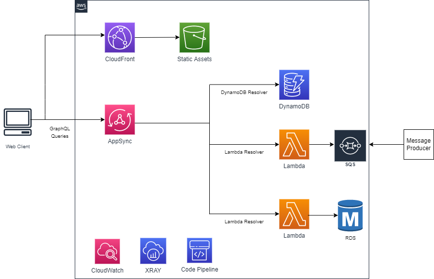

# appsync-websocket-api

This AppSync example demonstrate end-to-end implementations of a sample application using AWS AppSync built in funcationality to integrate a single GraphQL API with multiple backend data sources. The example uses AWS AppSync as the front door to the client application. The client application(s) will only need to use a single GraphQL API request to send a GraphQL query to AWS AppSync. In AppSync you will define the schema and resolvers. AppSync resolvers are functions that convert the GraphQL payload to the underlying storage/target service using VTL (Velocity Template Mapping). 

The sample uses a fictitious soccer club/players application where the end user can query the score and/or ranking of their favorite team and get the result in real time. In this use case, we will demosntrate the following three intergation scenarios using AppSync GraphQL API's

 - Intergate using DynamoDB resolvers to retrieve favorite soccer team score and/or ranking
 - Websocket integration to demostarte an "out of band" initiation of a message where a message producer places a message on SQS and AppSync resolvers fetch the message from the queue and return to the client application in real time
 - Intergate with Amazon RDS using a custom AppSync resolver (Lambda function) and return data requested by the client application
    
The sample application will use a serverless approach that align with AWS serverless best practices and address the following functaionality
 - Solution delpoyed using CI/CD pipeline that include CodePipeline, AWS CodeCommit, and AWS CodeBuild
 - IaC using SAM and CDK approaches
 - Observability: Logging & Monitoring using CloudWatch and XRAY. Including CloudWatch alarms and dashbaord
 - Automated unit and integration testing
 - Gloabl deployment using Amazon CloudFront and S3
 - Authentication/Authorization using IAM/Cognito

## Architecture

## Components created

The sample application will create the following resources in your AWS account: 
 - GraphQL API that uses AppSync as a front door to the sample application
    - DynamoDB - NoSQL database to store soccer teams/players data
    - IAM - roles and permissions for different AWS services included in the solution
    - CloudFront - To scale the application globally and improve performance
    - S3- Object storage for static assets (html/CSS, etc.) for the front end React application
    - Lambda - Lambda functions used as a custom AppSync resolver to access Amazon RDS
    - RDS - A SQL database to store soccer clubs ratings and scores
    - SQS- queues to receive message from a message producer. Message will be sent to the client via AppSync
    - CloudWatch- For logging and monitoring
    - XRAY- For tracing and troubleshooting
    - SAM - For IaC to automate solution deployment
    
## Observability configurations
  <Place holder>

## Testing  
< Place Holder>